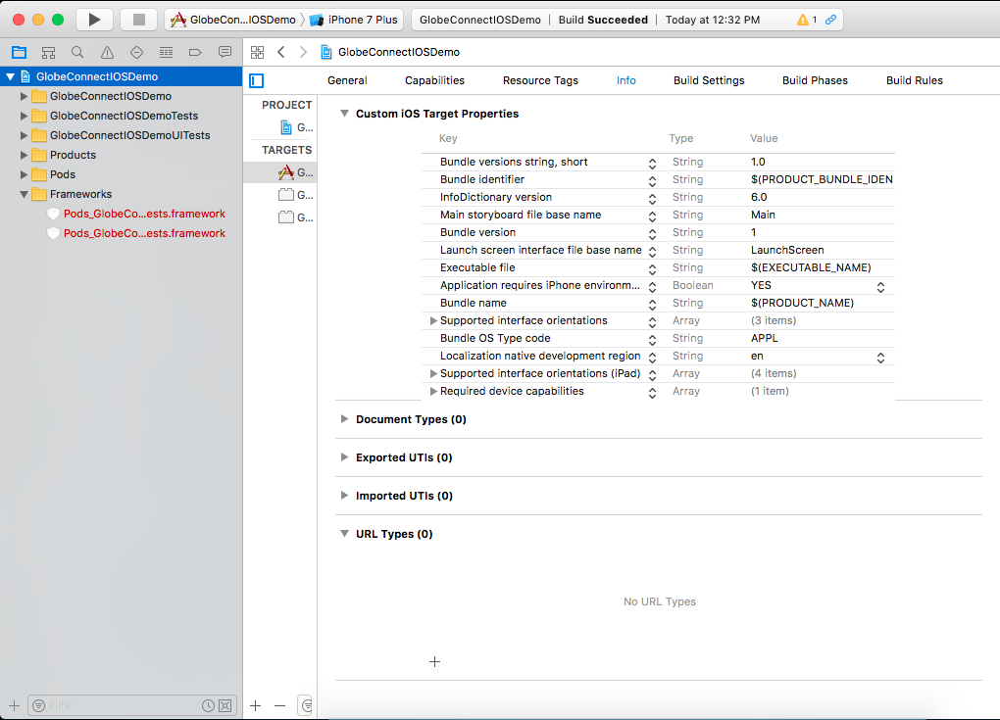

# Manual Installation

For manual installation you need to download the plugin here [https://globelabs.github.io](https://globelabs.github.io), select React as your sdk type then choose what API's you want to include with you SDK download, after that extract the zip file then execute this code on your project root.

```
react-native install /path/to/sdk-folder
```

# Installation via NPM

To install the SDK as a Cordova Plugin, execute this code on your project root.

```
react-native install react-native-globeconnect
```

After you install the sdk via manual / npm we need to some extra setup for the plugin to be able to work properly.

# Android Additional Setup

For you to be able to use the Authentication Activity for android, please add this to your app's AndroidManifest.xml located at YourProjectFolder/android/app/src/AndroidManifest.xml.

```xml
<activity android:name="ph.com.globe.connect.AuthenticationActivity" />
```

# iOS Additional Setup

Below are the steps on how to setup URL Schemes. This is a very important setup for the
Authentication process.

#### Setting up

Select your project in XCode and select **Info** and look for **URL Types**.


Click the add button and fillup the **Identifier** field and the **URL Schemes** field.


Next, open up your `AppDelegate.m` and add this code at the bottom of the class:
```
- (BOOL)application:(UIApplication *)application openURL:(NSURL *)url sourceApplication:(NSString *)sourceApplication annotation:(id)annotation {
  [[NSNotificationCenter defaultCenter] postNotificationName: @"globeLabsConnectedRedirect" object: url];
  return YES;
}
```

#### Server-side Redirect

Make sure when after Globe redirects you to your given url, check if the requests came from
the device and get the generated code from the URL then redirect again using your url scheme.

Example in PHP:

```php
<?php

if (strpos($_SERVER['HTTP_USER_AGENT'], 'iPhone')) {
    // redirect
    header('Location: globe-connect://redirect?code='.$_GET['code']);
}
```
